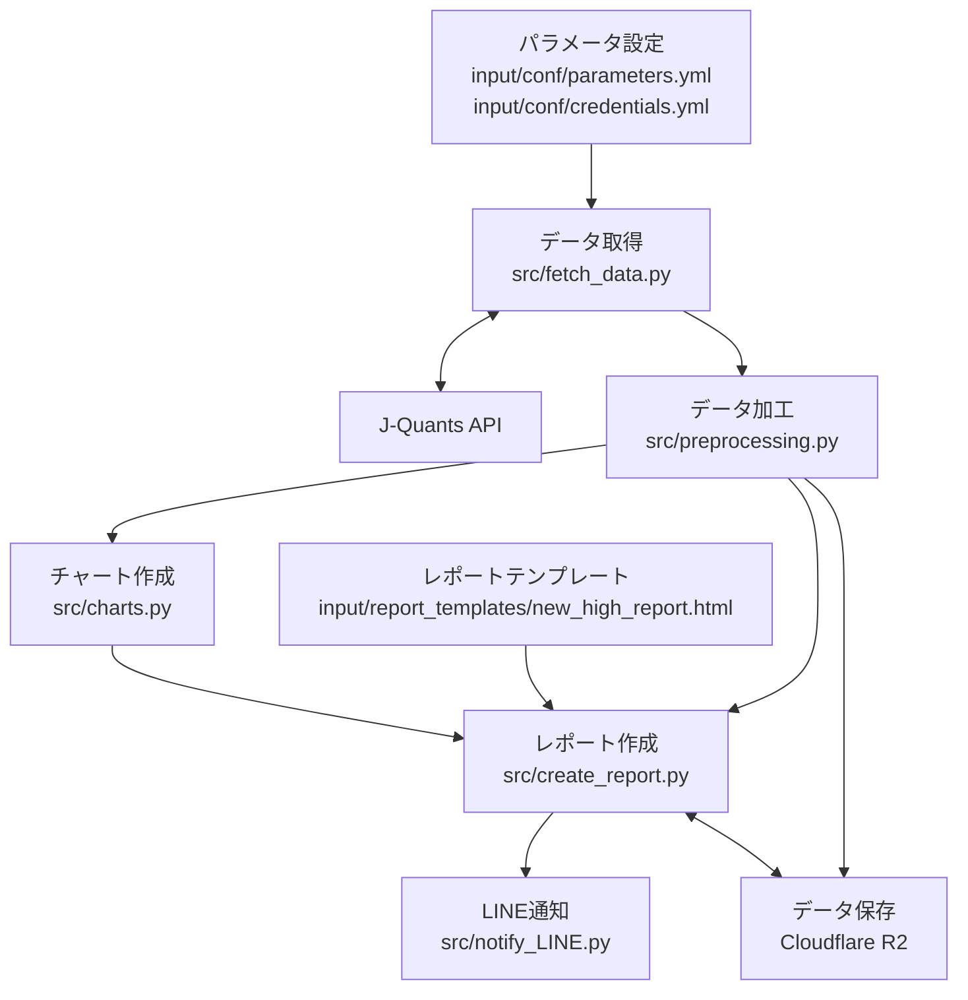

# J-Quants APIを使った新高値更新銘柄レポートの作成＆毎日のLINE通知

## 概要

本パイプラインは、J-Quants API から日本株の市場カレンダー・銘柄マスタ・日次株価データを取得し、直近営業日に過去365日での最高値を更新した銘柄を抽出するパイプラインです。

抽出した銘柄について、前日比・前週比・前月比を計算し、銘柄別チャートとともにレポートを生成します。生成した加工済みデータとPDFレポートは Cloudflare R2 にアップロードし、レポートURLを LINE Messaging API であなたのLINEに通知します。

## 開発の背景

このリポジトリは、過去365日での最高値を更新した日本株銘柄を毎日見やすい形でレポート化し、投資判断に活用することを目的としています。

対象市場は以下の3市場です。

- プライム市場
- スタンダード市場
- グロース市場

## 前提

- LINE通知について
-- LINE Messaging APIを使って、公式アカウントから友だち追加したユーザーにメッセージを送ることが出来ます。
-- J-Quants APIで取得したデータを他者へ配信することは規約上禁止されていますので、あくまで個人利用目的になります。
-- コード実行前に公式アカウントの作成、LINE Messaging APIの設定などを行う必要があります。
- 分析レポートの共有方法について
-- LINE Messaing APIでレポートを通知する際に、レポートのファイル自体ではなく、レポートの公開URLを通知します。公開URLは、ファイルをCloudflare R2上にレポートをアップロードすることで取得しています。
-- コード実行前にCloudflare R2のアカウント作成やAPIキー発行を行う必要があります。
- 定期実行について
-- Github Actionsで定期実行することを想定したコードになっています。

## 主な機能

- J-Quants APIからのデータ取得
-- 市場営業日がまとまったカレンダー（期間指定して取得）
-- 銘柄マスタ（特定の日付を指定して取得）
-- 日次株価データ（期間指定して取得）
- データ加工
-- 直近営業日に過去365日での最高値を更新した銘柄を抽出
-- 前日比・前週比・前月比を計算
- チャート出力
-- 対象銘柄の過去365日のチャートを出力
- レポート作成
-- Jinja2 テンプレートからHTMLレポートを生成
-- Playwright を使ってHTMLレポートをPDFに変換
-- PDFレポートを Cloudflare R2 にアップロード
- LINE通知
-- LINE Messaging API でレポートURLを通知

## 処理フロー

1. `main.py` を実行する
2. 実行時刻から `BATCH_ID` を生成する
3. `intermediate/`、`output/charts/`、`output/reports/` を作成する
4. `input/conf/parameters.yml` からAPIエンドポイントやR2設定を読み込む
5. `input/conf/credentials.yml` または環境変数から認証情報を読み込む
6. J-Quants API から市場カレンダーを取得し、直近営業日と過去365日分の営業日を取得する
7. J-Quants API から銘柄マスタを取得する
8. J-Quants API から日次株価データを取得する
9. 直近営業日に過去365日での最高値を更新した銘柄を抽出する
10. 前日比・前週比・前月比を計算する
11. 加工済みデータをParquet形式で保存し、Cloudflare R2へアップロードする
12. 抽出銘柄ごとの株価チャートをPNG形式で保存する
13. HTMLレポートを生成する
14. HTMLレポートをPDFへ変換する
15. PDFレポートを Cloudflare R2 へアップロードする
16. レポートURLを LINE で通知する

## アーキテクチャ図



## ディレクトリ構成

```text
.
├── .github/
│   └── workflows/
│       └── daily_new_high_pipeline.yml
├── input/
│   ├── conf/
│   │   ├── credentials.example.yml
│   │   ├── credentials.yml
│   │   └── parameters.yml
│   └── report_templates/
│       └── new_high_report.html
├── intermediate/
├── output/
│   ├── charts/
│   └── reports/
├── src/
│   ├── charts.py
│   ├── config.py
│   ├── create_report.py
│   ├── fetch_data.py
│   ├── notify_LINE.py
│   ├── preprocessing.py
│   └── utils.py
├── main.py
├── requirements.txt
├── pyproject.toml
└── README.md
```

主なファイルの役割は以下の通りです。

- `main.py`: パイプライン全体のエントリーポイント
- `src/config.py`: 認証情報の読み込み
- `src/fetch_data.py`: J-Quants API からのデータ取得
- `src/preprocessing.py`: 過去365日最高値更新銘柄の抽出、騰落率計算、Parquet保存、R2アップロード
- `src/charts.py`: 銘柄別チャート画像の生成
- `src/create_report.py`: HTML/PDFレポートの生成、R2アップロード
- `src/notify_LINE.py`: LINE通知メッセージの作成と送信
- `src/utils.py`: Cloudflare R2 アップロード処理
- `input/conf/parameters.yml`: APIエンドポイントやR2の保存先設定
- `input/conf/credentials.example.yml`: 認証情報ファイルのサンプル
- `input/conf/credentials.yml`: ローカル実行用の認証情報ファイル
- `input/report_templates/new_high_report.html`: レポート用HTMLテンプレート
- `.github/workflows/daily_new_high_pipeline.yml`: GitHub Actions の定期実行設定

`intermediate/`、`output/`、`work/`、`input/conf/credentials.yml` は `.gitignore` の対象です。

## セットアップ方法

### 1. Python環境を用意する

このリポジトリは Python 3.11 で実行する想定です。

```bash
python -m venv .venv
source .venv/bin/activate
```

Windows PowerShell の場合は以下です。

```powershell
python -m venv .venv
.\.venv\Scripts\Activate.ps1
```

### 2. 依存パッケージをインストールする

```bash
pip install -r requirements.txt
```

### 3. Playwright のブラウザをインストールする

PDF生成で Playwright の Chromium を使用します。

```bash
playwright install chromium
```

GitHub Actions では以下のコマンドで依存ライブラリ込みでインストールしています。

```bash
playwright install --with-deps chromium
```

### 4. 認証情報ファイルを作成する

ローカル実行時は `input/conf/credentials.example.yml` を参考に、`input/conf/credentials.yml` を作成します。

```bash
cp input/conf/credentials.example.yml input/conf/credentials.yml
```

`credentials.yml` にはAPIキーやトークンを設定します。このファイルは `.gitignore` に含まれているため、リポジトリにコミットしないでください。

## 設定ファイル

### `input/conf/parameters.yml`

APIエンドポイントやCloudflare R2の保存先を定義します。

- `jquants.base_url`: J-Quants API のベースURL
- `jquants.paths.equities_master`: 銘柄マスタ取得用パス
- `jquants.paths.daily_bars`: 日次株価データ取得用パス
- `jquants.paths.markets_calender`: 市場カレンダー取得用パス
- `LINE.base_url`: LINE Messaging API のベースURL
- `LINE.paths.broadcast`: LINEブロードキャスト送信用パス
- `cloudflare.r2.public_dev_url`: Cloudflare R2 の公開URLテンプレート
- `cloudflare.r2.backet_name`: Cloudflare R2 のバケット名
- `cloudflare.r2.paths.new_high_report`: PDFレポートのアップロード先フォルダ
- `cloudflare.r2.paths.preprocessed_table`: 加工済みParquetのアップロード先フォルダ

### `input/conf/credentials.yml`

ローカル実行時に使用する認証情報ファイルです。形式は `input/conf/credentials.example.yml` を参照してください。

必要な認証情報は以下です。

- J-Quants APIキー
- LINE Messaging API のチャネルアクセストークン
- Cloudflare アカウントID
- Cloudflare R2 アクセスキーID
- Cloudflare R2 シークレットアクセスキー
- Cloudflare R2 Public Development URL 用ID

実際のAPIキーやトークンはREADMEやGit管理対象ファイルに記載しないでください。

### GitHub Actions Secrets

GitHub Actions で実行する場合は、`credentials.yml` ではなく以下のSecretsを使用します。

- `JQUANTS_API_KEY`
- `LINE_CHANNEL_ACCESS_TOKEN`
- `CLOUDFLARE_ACCOUNT_ID`
- `R2_ACCESS_KEY_ID`
- `R2_SECRET_ACCESS_KEY`
- `R2_PUBLIC_DEV_ID`

## 実行方法

ローカルでは以下を実行します。

```bash
python main.py
```

実行すると、主に以下のファイルが生成されます。

```text
intermediate/new_highs_df_{営業日}.parquet
output/charts/{銘柄コード}.png
output/reports/new_high_report_{営業日}.html
output/reports/new_high_report_{営業日}.pdf
```

また、加工済みParquetファイルとPDFレポートは Cloudflare R2 にアップロードされます。PDFレポートの公開URLは LINE で通知されます。

## GitHub Actionsでの定期実行

GitHub Actions の設定は `.github/workflows/daily_new_high_pipeline.yml` にあります。

```yaml
name: Daily New High Pipeline

on:
  schedule:
    - cron: "0 11 * * *"
  workflow_dispatch:
```

`cron: "0 11 * * *"` はUTC基準のため、日本時間では毎日20:00に実行されます。

また、`workflow_dispatch` が設定されているため、GitHub Actions の画面から手動実行することもできます。

ワークフローでは以下を実行します。

1. リポジトリをチェックアウト
2. Python 3.11 をセットアップ
3. `requirements.txt` の依存パッケージをインストール
4. Playwright Chromium をインストール
5. `python main.py` を実行

## 今後の改善案

- APIエラー時の例外処理を強化する
- J-Quants API のレート制限に対するリトライ処理を改善する
- `pyproject.toml` と `requirements.txt` の依存関係を整理する
- ログ出力を整備する
- GitHub Actions 実行時の成果物保存や失敗時の通知を追加する
- レポートの表示項目や並び順を設定ファイルで変更できるようにする
- 対象市場や抽出条件を設定ファイル化する

## 注意事項

- `input/conf/credentials.yml` には秘匿情報が含まれるため、コミットしないでください。
- READMEやIssue、Pull Requestに実際のAPIキーやトークンを記載しないでください。
- このパイプラインは銘柄抽出とレポート配信を目的としたものであり、投資判断を保証するものではありません。
